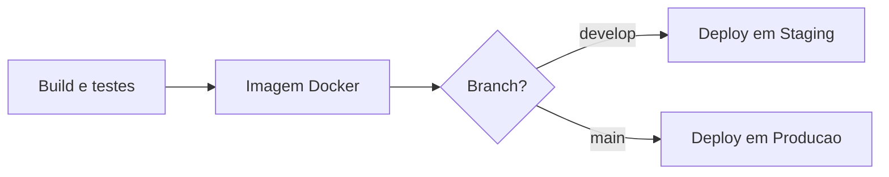
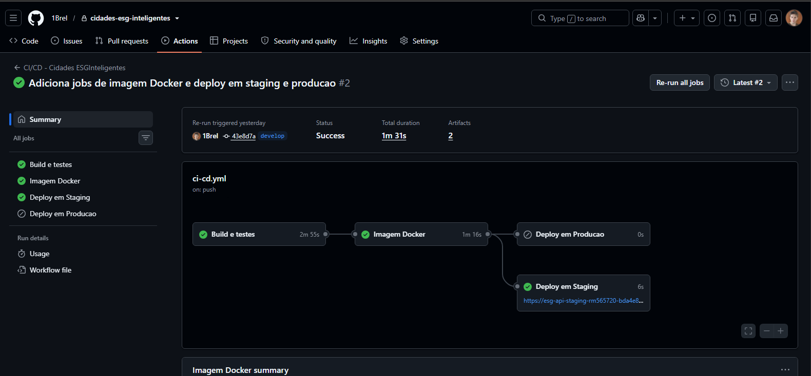
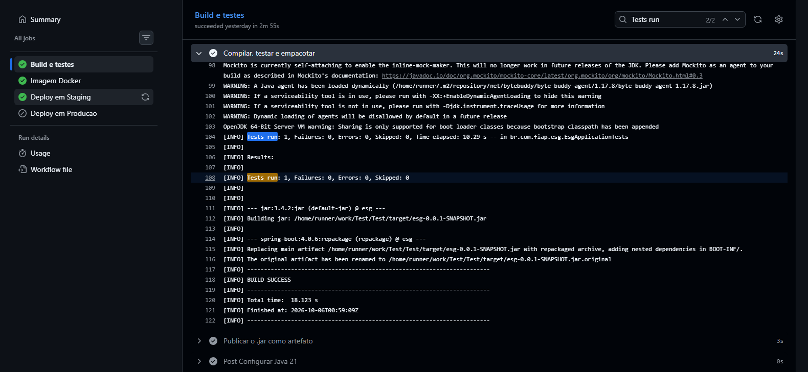
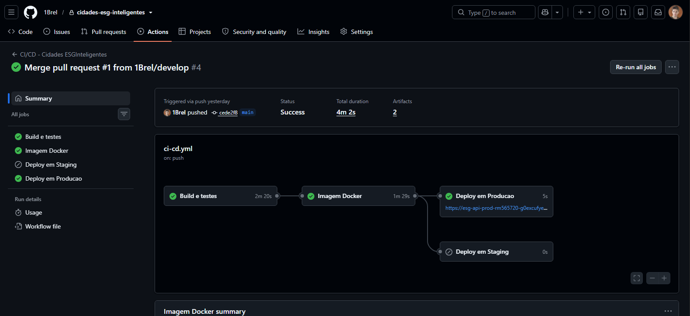
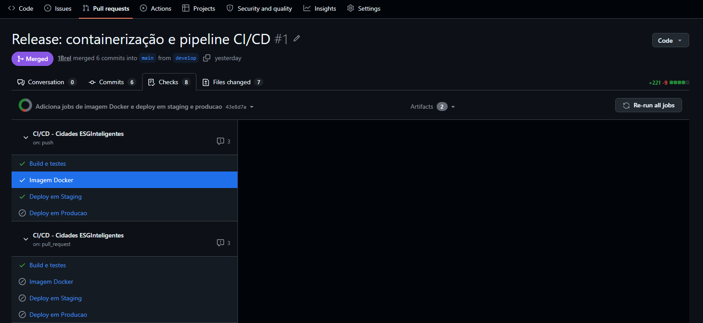
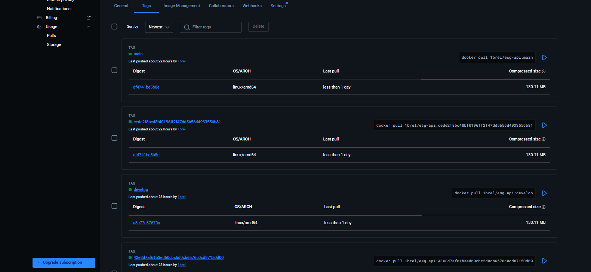
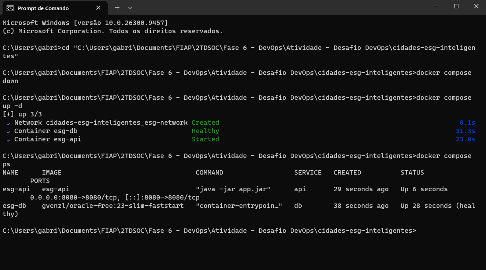
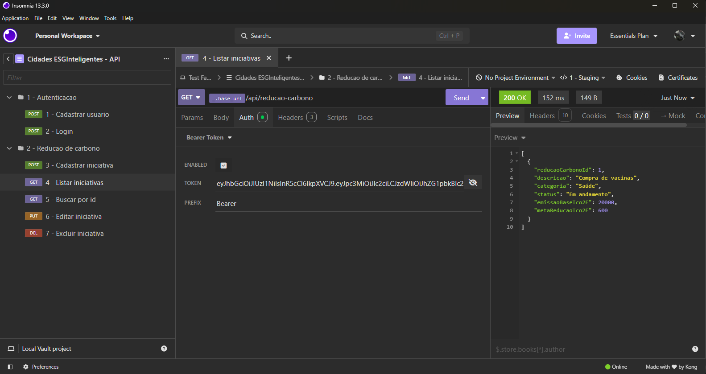
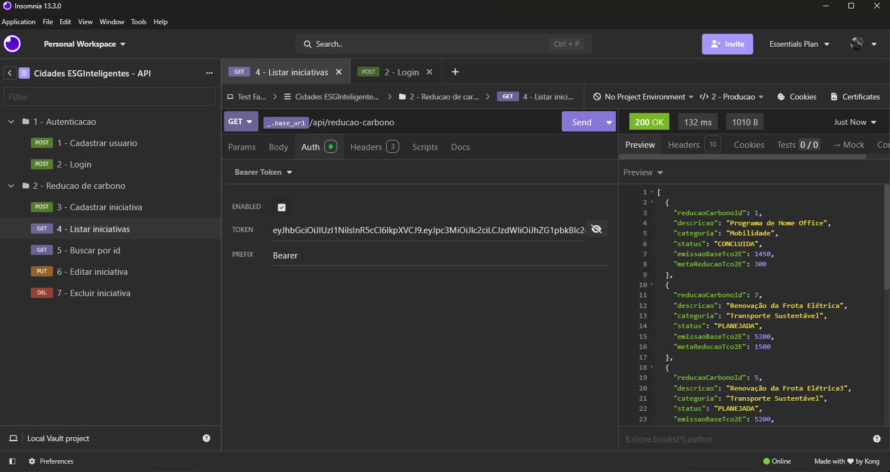
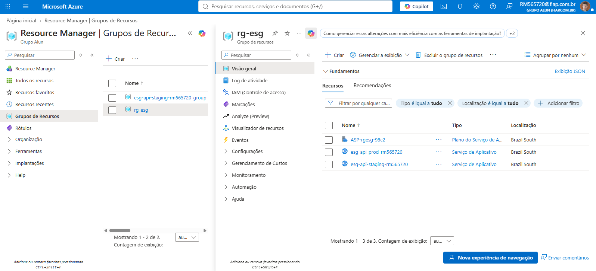

# Projeto - Cidades ESGInteligentes

API REST em Java/Spring Boot para o cadastro e acompanhamento de **iniciativas de redução de emissões de carbono**, com autenticação via token JWT. Este projeto aplica práticas de **DevOps** sobre a aplicação: containerização com Docker, orquestração com Docker Compose e um pipeline de **CI/CD** no GitHub Actions com deploy automatizado em dois ambientes na Microsoft Azure.

**Integrantes:**
- Gabriel Camargo Suannes - rm565720
- Uílian Almeida de Carvalho - rm564795

**Ambientes publicados:**

| Ambiente | Branch | Endereço |
|---|---|---|
| Staging | `develop` | https://esg-api-staging-rm565720-bda4e8emeefkdkf7.brazilsouth-01.azurewebsites.net |
| Produção | `main` | https://esg-api-prod-rm565720-g0excufye4cpedc6.brazilsouth-01.azurewebsites.net |

> ⏱️ Os ambientes são iniciados sob demanda. O primeiro acesso após um período sem uso pode levar até 2 minutos. Ao acessar um endpoint pelo navegador, a resposta esperada é **403**, pois a API exige autenticação.

---

## Como executar localmente com Docker

### Pré-requisitos

- [Docker Desktop](https://www.docker.com/products/docker-desktop/) instalado e em execução
- Git
- Cerca de 2 GB de memória livre (o banco Oracle roda em container)

### Passo a passo

**1. Clone o repositório e entre na pasta:**

```bash
git clone https://github.com/1Brel/cidades-esg-inteligentes.git
cd cidades-esg-inteligentes
```

**2. Crie o arquivo `.env` a partir do modelo:**

```bash
# Linux / macOS / Git Bash
cp .env.example .env

# Windows (PowerShell)
Copy-Item .env.example .env
```

Abra o `.env` e defina as senhas (`DATABASE_PWD`, `DB_ADMIN_PASSWORD`) e a chave `JWT_SECRET`. Use apenas letras e números nas senhas. O banco é criado com esses valores na primeira execução.

**3. Suba a aplicação e o banco de dados:**

```bash
docker compose up --build
```

Na primeira execução, o download das imagens e a inicialização do Oracle levam alguns minutos. A aplicação está pronta quando o log exibir `Started EsgApplication`. Para subir em segundo plano, use `docker compose up -d --build` e acompanhe com `docker compose ps`.

**4. Teste a API:**

Acesse `http://127.0.0.1:8080/api/reducao-carbono`. A resposta esperada é **403 (Forbidden)**, pois o endpoint exige autenticação. Para testar os endpoints, use a coleção do Insomnia (seção abaixo) com o ambiente **3 - Local (Docker Compose)**.

> 💡 Em alguns ambientes Windows, `localhost` é resolvido para IPv6 e o encaminhamento de portas do Docker falha. Use `127.0.0.1`.

**5. Encerre o ambiente:**

```bash
docker compose down      # remove os containers; os dados do banco são mantidos no volume
docker compose down -v   # remove também o volume (apaga os dados do banco)
```

### Variáveis de ambiente

| Variável | Descrição |
|---|---|
| `DATABASE_URL` | URL JDBC do Oracle. No Compose: `jdbc:oracle:thin:@db:1521/FREEPDB1` |
| `DATABASE_USER` | Usuário da aplicação no banco |
| `DATABASE_PWD` | Senha do usuário da aplicação |
| `DB_ADMIN_PASSWORD` | Senha do administrador do Oracle (usada apenas na criação do banco) |
| `JWT_SECRET` | Chave usada para assinar os tokens JWT |
| `APP_PORT` | Porta do host onde a API fica acessível (padrão: `8080`) |

O arquivo `.env` contém segredos e **não é versionado** (está no `.gitignore` e no `.dockerignore`). O `.env.example` serve como modelo.

---

## Como testar a API (Insomnia)

A pasta `insomnia/` contém a coleção `ESG_API_Insomnia.yaml`, com todas as requisições prontas e três ambientes configurados.

| Ambiente | Endereço |
|---|---|
| 1 - Staging *(padrão)* | Ambiente de staging na Azure |
| 2 - Producao | Ambiente de produção na Azure |
| 3 - Local (Docker Compose) | `http://127.0.0.1:8080` (requer o `docker compose up`) |

**Roteiro de teste:**

1. No Insomnia, importe o arquivo `insomnia/ESG_API_Insomnia.yaml` e selecione o ambiente desejado.
2. Execute **1 - Cadastrar usuario**. Ele cria o usuário de avaliação `professor.avaliacao@esg.com` (senha `Avaliacao2026`, perfil ADMIN).
3. Execute **2 - Login** e copie o valor de `token` da resposta.
4. Na requisição desejada, na aba **Auth**, cole o token na variável `TOKEN`.
5. Execute as demais requisições:

| # | Requisição | Método | Endpoint | Perfil exigido |
|---|---|---|---|---|
| 3 | Cadastrar iniciativa | POST | `/api/reducao-carbono` | ADMIN |
| 4 | Listar iniciativas | GET | `/api/reducao-carbono` | ADMIN ou USER |
| 5 | Buscar por id | GET | `/api/reducao-carbono/{id}` | autenticado |
| 6 | Editar iniciativa | PUT | `/api/reducao-carbono` | ADMIN |
| 7 | Excluir iniciativa | DELETE | `/api/reducao-carbono/{id}` | ADMIN |

Nas requisições 5, 6 e 7, substitua o id pelo `reducaoCarbonoId` retornado na listagem.

> Cada ambiente tem sua própria chave de assinatura JWT. Ao trocar de ambiente, faça o login novamente e cole o novo token no ambiente correspondente.

---

## Pipeline CI/CD

### Ferramentas

| Ferramenta | Papel no pipeline |
|---|---|
| **GitHub Actions** | Orquestra todas as etapas do pipeline (`.github/workflows/ci-cd.yml`) |
| **Maven** | Compilação, execução dos testes e empacotamento do `.jar` |
| **Oracle Database Free** (service container) | Banco temporário para os testes de integração |
| **Docker Buildx** | Construção da imagem da aplicação |
| **Docker Hub** | Registro onde as imagens são publicadas (`1brel/esg-api`) |
| **Azure App Service** (Web App for Containers) | Hospedagem dos ambientes de staging e produção |
| **GitHub Secrets** | Armazenamento seguro das credenciais do Docker Hub e da Azure |

### Estratégia de branches

```
feature/*  ──PR──►  develop  ──PR──►  main
                       │                │
                       ▼                ▼
                    STAGING          PRODUÇÃO
```

- **`develop`**: integração das mudanças; todo push publica em **staging**.
- **`main`**: versão estável; recebe código apenas via Pull Request a partir da `develop`, e todo push publica em **produção**.

### Etapas do pipeline



| Job | Quando executa | O que faz |
|---|---|---|
| **1. Build e testes** | Push e Pull Request para `develop`/`main` | Sobe um Oracle temporário como *service container*, instala o Java 21, executa `mvn clean verify` (compilação, testes e empacotamento) e publica o `.jar` como artefato |
| **2. Imagem Docker** | Apenas em push, após o job 1 passar | Constrói a imagem com o Dockerfile e a envia ao Docker Hub com duas tags: o SHA do commit (versão imutável) e o nome da branch |
| **3. Deploy em Staging** | Apenas na branch `develop` | Atualiza o Web App de staging na Azure com a imagem do commit |
| **4. Deploy em Produção** | Apenas na branch `main` | Atualiza o Web App de produção na Azure com a imagem do commit |

### Funcionamento

- **Proteção por dependência (`needs`)**: se os testes falharem, nenhuma imagem é gerada e nenhum deploy ocorre.
- **Pull Requests apenas validam**: em um PR, somente o job de build e testes é executado. O código só é publicado após o merge.
- **Rastreabilidade**: cada deploy usa a imagem marcada com o SHA do commit, permitindo identificar exatamente qual versão está em cada ambiente e retornar a uma versão anterior.
- **Configuração por ambiente**: cada Web App possui suas próprias variáveis de ambiente (banco de dados, chave JWT). Staging e produção usam bancos Oracle distintos, garantindo isolamento entre os ambientes. A mesma imagem roda nos dois ambientes; muda apenas a configuração.
- **Segredos**: credenciais ficam nos *GitHub Secrets* (`DOCKERHUB_USERNAME`, `DOCKERHUB_TOKEN`, `AZURE_PUBLISH_PROFILE_STAGING`, `AZURE_PUBLISH_PROFILE_PROD`) e nas variáveis de ambiente da Azure, nunca no código.

---

## Containerização

### Dockerfile

```dockerfile
# ============================================================
# ETAPA 1 - BUILD: compila o projeto e gera o .jar
# ============================================================
FROM maven:3.9-eclipse-temurin-21 AS build

WORKDIR /app

# Copia primeiro só o pom.xml e baixa as dependências.
# Enquanto o pom.xml não mudar, o Docker reaproveita essa camada
# e os próximos builds ficam muito mais rápidos.
COPY pom.xml .
RUN mvn -B dependency:go-offline

# Agora copia o código-fonte e gera o .jar
# (os testes rodam no pipeline de CI, por isso são pulados aqui)
COPY src ./src
RUN mvn -B clean package -DskipTests

# ============================================================
# ETAPA 2 - RUNTIME: imagem leve, só com o necessário para rodar
# ============================================================
FROM eclipse-temurin:21-jre-alpine

WORKDIR /app

# Cria um usuário sem privilégios de administrador (segurança)
RUN addgroup -S app && adduser -S app -G app

# Traz da etapa de build apenas o .jar pronto
COPY --from=build /app/target/*.jar app.jar

# Passa a rodar como o usuário sem privilégios
USER app

# Documenta a porta que a aplicação usa
EXPOSE 8080

# Comando que inicia a aplicação quando o container sobe
ENTRYPOINT ["java", "-jar", "app.jar"]
```

### Estratégias adotadas

- **Build multi-stage**: a primeira etapa usa uma imagem completa (Maven + JDK) para compilar; a segunda usa apenas o JRE em Alpine. A imagem final não contém Maven nem código-fonte, ficando menor e com menor superfície de ataque.
- **Cache de dependências**: o `pom.xml` é copiado e as dependências são baixadas antes do código-fonte. Alterações apenas no código reaproveitam a camada de dependências, acelerando os builds.
- **Execução sem privilégios**: a aplicação roda com um usuário comum (`app`), e não como `root`.
- **Configuração externa**: nenhuma credencial está na imagem. Banco de dados e chave JWT são informados por variáveis de ambiente em tempo de execução, o que permite usar a mesma imagem em todos os ambientes e publicá-la em um registro público com segurança.
- **`.dockerignore`**: impede que arquivos desnecessários ou sensíveis (`.env`, `target/`, `.git/`, configurações de IDE) entrem no contexto de build.
- **Testes fora da imagem**: os testes são executados no pipeline de CI, contra um banco real, e não durante a construção da imagem.

### Orquestração com Docker Compose

O `docker-compose.yml` define dois serviços:

| Serviço | Imagem | Função |
|---|---|---|
| `db` | `gvenzl/oracle-free:23-slim-faststart` | Banco Oracle Database Free; cria automaticamente o usuário da aplicação a partir das variáveis de ambiente |
| `api` | Construída a partir do `Dockerfile` | A aplicação Spring Boot |

Recursos utilizados:

- **Rede** (`esg-network`, driver *bridge*): rede interna isolada em que a API acessa o banco pelo nome do serviço (`db:1521`).
- **Volume nomeado** (`esg-db-data`): persiste os arquivos do banco fora do container. Os dados sobrevivem a `docker compose down` e à recriação dos containers.
- **Variáveis de ambiente**: lidas do arquivo `.env`, sem credenciais no arquivo de orquestração.
- **Healthcheck + `depends_on`**: a API só é iniciada quando o banco está saudável e aceitando conexões.
- **Porta configurável**: `${APP_PORT:-8080}` permite alterar a porta do host sem editar o arquivo.

### Banco de dados e migrations

O esquema do banco é versionado com **Flyway** (`src/main/resources/db/migration`). Em cada ambiente, as migrations são aplicadas automaticamente na inicialização da aplicação, garantindo que local, CI, staging e produção tenham a mesma estrutura de tabelas.

---

## Prints do funcionamento

### Pipeline na branch `develop` (deploy em staging)

O push na `develop` executa build, testes, publicação da imagem e deploy em staging. O deploy em produção é ignorado.



### Execução dos testes automatizados



### Pipeline na branch `main` (deploy em produção)

Após o merge do Pull Request, o pipeline publica em produção. O deploy em staging é ignorado.



### Pull Request da `develop` para a `main`

No Pull Request, apenas o job de build e testes é executado, validando o código antes do merge.



### Imagens publicadas no Docker Hub



### Ambiente local com Docker Compose



### Ambiente de staging funcionando



### Ambiente de produção funcionando



### Recursos na Azure



---

## Tecnologias utilizadas

**Aplicação**
- Java 21
- Spring Boot 4 (Spring Web, Spring Data JPA, Spring Security, Bean Validation)
- JWT (autenticação via token)
- Hibernate
- Flyway (versionamento do banco de dados)
- Maven

**Banco de dados**
- Oracle Database Free 23ai (ambiente local e pipeline de CI, em container)
- Oracle Database 19c FIAP (ambientes de staging e produção)

**DevOps e infraestrutura**
- Docker e Docker Compose
- GitHub Actions
- Docker Hub
- Microsoft Azure App Service (Web App for Containers, Linux)

**Ferramentas**
- Git e GitHub
- Insomnia

---

## Checklist de entrega

- [x] Projeto compactado em .ZIP com estrutura organizada
- [x] Dockerfile funcional
- [x] docker-compose.yml ou arquivos Kubernetes
- [x] Pipeline com etapas de build, teste e deploy
- [x] README.md com instruções e prints
- [x] Documentação técnica com evidências (PDF ou PPT)
- [x] Deploy realizado nos ambientes staging e produção